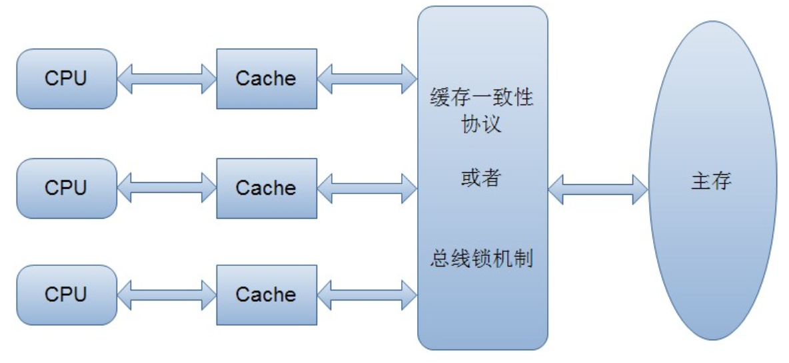
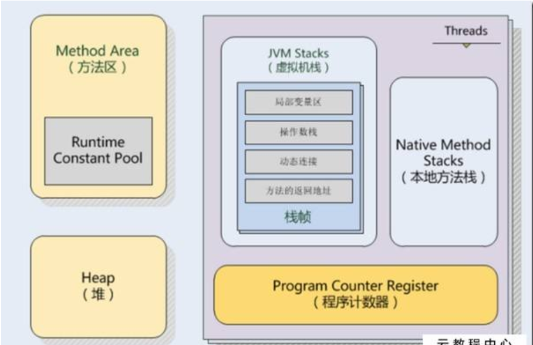
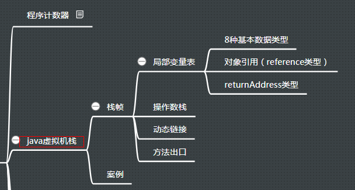
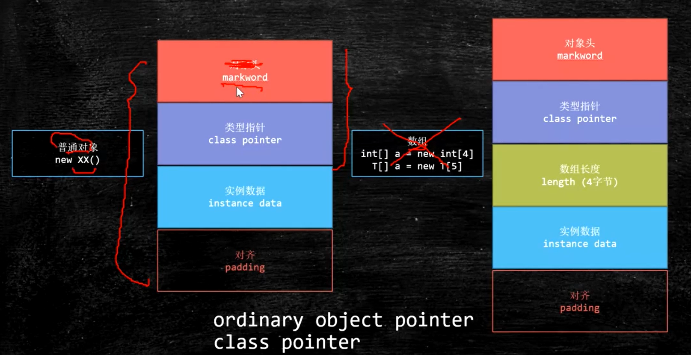

## java的内存模型

### 1.计算机的内存模型

对于cpu来讲，一个cpu的核有ALU,PC,REGISTER。算数逻辑单元 负责计算和执行指令。指令读取器。寄存器：做高速缓存的。超线程的概念：4核8线程。一个alu能对应处理2组 PC ,Register。因为alu处理速度太快。在多核cpu模型中，共享l3缓存空间，l1和l2是每个cpu独有的。

保证多个cpu之间的数据一致性一般有两种操作：锁总线和缓存一致性。最出名的就是Intel 的MESI协议，MESI协议保证了每个缓存中使用的共享变量的副本是一致的。它核心的思想是：当CPU写数据时，如果发现操作的变量是共享变量，即在其他CPU中也存在该变量的副本，会发出信号通知其他CPU将该变量的缓存行置为无效状态，因此当其他CPU需要读取这个变量时，发现自己缓存中缓存该变量的缓存行是无效的，那么它就会从内存重新读取。

### 2.java的内存模型jmm

黄色的为线程共享区域。

- 方法区（公有）：用户存储已被虚拟机加载的类信息，常量，静态常量，即时编译器编译后的代码等数据。异常状态 OutOfMemoryError。
- 堆（公有）：是JVM所管理的内存中最大的一块。唯一目的就是存放实例对象，几乎所有的对象实例都在这里分配。Java堆是垃圾收集器管理的主要区域，因此很多时候也被称为“GC堆”。异常状态 OutOfMemoryError。
- 虚拟机栈（线程私有）： 描述的是java方法执行的内存模型：每个方法在执行时都会创建一个栈帧，用户存储局部变量表，操作数栈，动态连接，方法出口等信息。每一个方法从调用直至完成的过程，就对应着一个栈帧在虚拟机栈中入栈到出栈的过程。 对这个区域定义了两种异常状态 OutOfMemoryError StackOverflowError。
- 本地方法栈（线程私有）：与虚拟机栈所发挥的作用相似。它们之间的区别不过是虚拟机栈为虚拟机执行java方法，而本地方法栈为虚拟机使用到的Native方法服务。
- 程序计数器（线程私有）：一块较小的内存，当前线程所执行的字节码的行号指示器。字节码解释器工作时，就是通过改变这个计数器的值来选取下一条需要执行的字节码指令。多线程顺利切换的保证。

### 3.java中的虚拟机栈

1. Java虚拟机栈也是线程私有的，它的生命周期与线程相同（随线程而生，随线程而灭）

　2. 如果线程请求的栈深度大于虚拟机所允许的深度，将抛出StackOverflowError异常；

　　如果虚拟机栈可以动态扩展，如果扩展时无法申请到足够的内存，就会抛出OutOfMemoryError异常；

　（当前大部分JVM都可以动态扩展，只不过JVM规范也允许固定长度的虚拟机栈）

　3. Java虚拟机栈描述的是Java方法执行的内存模型：每个方法执行的同时会创建一个栈帧。

　　对于我们来说，主要关注的stack栈内存，就是虚拟机栈中局部变量表部分。

- 在java的虚拟机栈中存放了局部变量引用和局部基本数据类型的数据，注意只是局部的，因为这部分不是共享的数据，定义为对象的属性的字段或域是存放在堆中的，即使是基本数据类型，局部变量表要用，只会存一个refrence。
- 每个栈帧都包含一个指向运行时常量池中该栈帧所属方法的引用，持有这个引用是为了支持方法调用过程中的动态连接（Dynamic Linking）。在类加载阶段中的解析阶段会将符号引用转为直接引用，这种转化也称为静态解析。另外的一部分将在每一次运行时期转化为直接引用。这部分称为动态连接。

### 4.当new一个对象时，在堆中会分配多少个字节的内存？

可以使用org.openjdk.jol的ClassLayout来查看对象在堆中的布局。

- markword占了8个字节，cp占4个字节。两个并称为对象头。
- 实例数据就是类型本身的大小，对齐指必须为8的最小整数倍。
- cp默认是采用的压缩指针，如果不压缩就是8个字节（64位的jvm）。
- markword中存储了锁的信息。
- 锁的升级过程：无锁->偏向锁->自旋锁 **自旋有一定次数，如果超过设置自旋的次数则升级到重量级锁**，**或者一个线程在持有锁，一个在自旋，又有第三个来访时，轻量级锁升级为重量级锁，重量级锁使除了拥有锁的线程以外的线程都阻塞，防止CPU空转**->重量级锁。