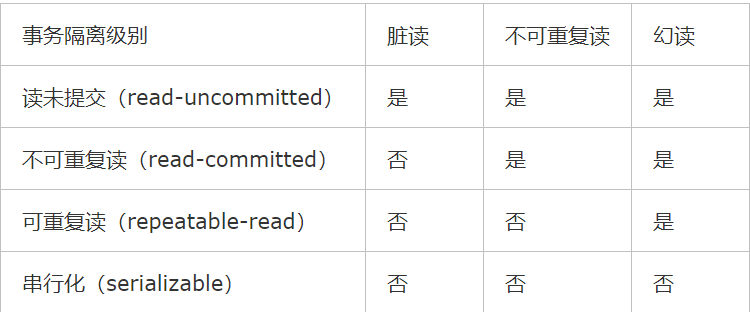

## 事务的隔离级别

### 1.事务

事务就是一些操作的集合，我们会用一些手段去保证四个特性acid。

### 2.四个特性

- 原子性：所有的操作是一个整体，要么一起完成，要么一起回滚
- 一致性（Consistency）：事务执行中，每次相同的操作获取数据是一致的
- 隔离性（Isolation）：隔离性是当多个用户并发访问数据库时，比如操作同一张表时，数据库为每一个用户开启的事务，不能被其他事务的操作所干扰，多个并发事务之间要相互隔离
- 持久性（Durability）**：**当事务正确完成后，它对于数据的改变是永久性的

### 3.隔离级别

#### 3.1并发中会出现的问题

- 脏读：一个事务能读到另外一个事务没有提交的数据。
- 不可重读读：一个事务中的两次读取的内容不一致或丢失了一部分数据（针对另外事务的update和delete）
- 幻读：一个事务中的两次读取的数量不一致（针对另外事务的insert）

#### 3.2 事务的隔离级别

mysql的事务隔离级别

#### 3.3mysql中innodb的解决方案

- #### 锁机制

1. 共享锁：允许事务读取一行数据。排他锁，允许事务更新一行数据。行级锁中除了read和read可以兼容，其他都是隔离的

2. InnoDB还支持两种意向锁（即为表级别的锁）：

   - 意向共享锁（读锁 IS Lock），事务想要获取一张表的几行数据的共享锁，事务在给一个数据行加共享锁前必须先取得该表的IS锁。
   - 意向排他锁（写锁 IX Lock），事务想要获取一张表中几行数据的排它锁，事务在给一个数据行加排他锁前必须先取得该表的IX锁。

   InnoDB有3种行锁的算法：

   - Record Lock：单个行记录上的锁
   - Gap Lock：间隙锁，锁定一个范围，而非记录本身
   - Next-Key Lock：结合Gap Lock和Record Lock，锁定一个范围，并且锁定记录本身。主要解决的问题是RR隔离级别下的幻读

   默认是rr级别的隔离。

- #### mvcc机制

  事务隔离性由锁实现，原子性、一致性和持久性由数据库的redo log和undo log。redo log称为重做日志，用来保证事务的原子性和持久性，恢复提交事务修改的页操作。undo log来保证事务的一致性，undo回滚行记录到某个特性版本及MVCC功能。两者内容不同。redo记录物理日志，undo是逻辑日志。

